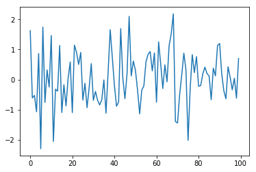
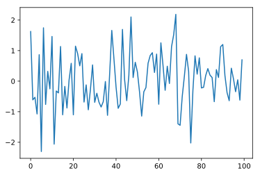

# IPython Magic 魔术

## 简介

两种`magic`命令：
* `Line magics`：`%`，只接受该行的参数
* `Cell magics`: `%%`，只能用在`cell`首行，`%%`接收的`magic`参数包括整个`cell`，并且每个单元格只能用一个`cell`


```python
# 列出可用的魔法命令
%lsmagic
```


    Available line magics:
    %alias  %alias_magic  %autocall  %automagic  %autosave  %bookmark  %cd  %clear  %cls  %colors  %config  %connect_info  %copy  %ddir  %debug  %dhist  %dirs  %doctest_mode  %echo  %ed  %edit  %env  %gui  %hist  %history  %killbgscripts  %ldir  %less  %load  %load_ext  %loadpy  %logoff  %logon  %logstart  %logstate  %logstop  %ls  %lsmagic  %macro  %magic  %matplotlib  %mkdir  %more  %notebook  %page  %pastebin  %pdb  %pdef  %pdoc  %pfile  %pinfo  %pinfo2  %popd  %pprint  %precision  %profile  %prun  %psearch  %psource  %pushd  %pwd  %pycat  %pylab  %qtconsole  %quickref  %recall  %rehashx  %reload_ext  %ren  %rep  %rerun  %reset  %reset_selective  %rmdir  %run  %save  %sc  %set_env  %store  %sx  %system  %tb  %time  %timeit  %unalias  %unload_ext  %who  %who_ls  %whos  %xdel  %xmode
    
    Available cell magics:
    %%!  %%HTML  %%SVG  %%bash  %%capture  %%cmd  %%debug  %%file  %%html  %%javascript  %%js  %%latex  %%perl  %%prun  %%pypy  %%python  %%python2  %%python3  %%ruby  %%script  %%sh  %%svg  %%sx  %%system  %%time  %%timeit  %%writefile
    
    Automagic is ON, % prefix IS NOT needed for line magics.


## 简单`Magic`


```python
%matplotlib inline
import numpy as np 
import matplotlib.pyplot as plt
```


```python
# %timeit计算代码执行时间
%timeit np.linalg.eigvals(np.random.rand(100,100))
```

    100 loops, best of 3: 7.31 ms per loop
    

### 计算整个`cell` 代码运行时间


```python
%%timeit a = np.random.rand(100, 100)
np.linalg.eigvals(a)
```

    100 loops, best of 3: 6.98 ms per loop
    

### `%%capture`捕获`cell`输出`stdout/stderr`


```python
%%capture capt
from __future__ import print_function
import sys
print('Hello stdout')
print('and stderr', file=sys.stderr)
```


```python
capt.stdout,capt.stderr
```


    ('Hello stdout\n', 'and stderr\n')


```python
capt.show()
```

    Hello stdout
    

    and stderr
    

### `%%capture result`有同样的功能


```python
%%capture result

print([1,2,3])
```


```python
result.stdout
```


    '[1, 2, 3]\n'


```python
result.show()
```

    [1, 2, 3]
    

### `%%scipy cell magic`

* `%%writefile`我就不说了，IPython具有`%%scipy` `cell magic`，它允许您在系统上的任何解释器的子进程中运行`cell`，例如：`bash，ruby，perl，zsh，R`等,甚至自己的脚本也能运行.
* 要使用它，只需将path或shell命令传递给要在`%%scipy`行上运行的程序，该脚本的其余部分将由该脚本运行，并捕获并显示子进程中的`stdout/stderr`。


```python
%%script python
import sys
print 'hello from Python %s' % sys.version
```

    hello from Python 2.7.13 (v2.7.13:a06454b1afa1, Dec 17 2016, 20:42:59) [MSC v.1500 32 bit (Intel)]


```python
%%script python3
import sys
print('hello from Python: %s' % sys.version)
```

    hello from Python: 3.6.3 (v3.6.3:2c5fed8, Oct  3 2017, 17:26:49) [MSC v.1900 32 bit (Intel)]


`IPython`还为一些常见的解释器创建别名，例如`bash，ruby，perl`等。
这些都等同于`%% script <name> `


```bash
%%bash
echo "hello from $BASH"
```

    hello from /usr/bin/bash
    

### `--out` `--err`捕获`cell`魔法的输出 


```bash
%%bash
echo "hi, stdout"
echo "hello, stderr" >&2
```

    hi, stdout
    

    hello, stderr
    


```bash
%%bash --out output --err error
echo "hi, stdout"
echo "hello, stderr" >&2
```


```python
print(error)
print(output)
```

    hello, stderr
    
    hi, stdout
    
    


```python
%matplotlib inline
import pylab as pl
pl.seed(1)
data = pl.randn(100)
pl.plot(data);
```





### 配合 `%config InlineBackend.figure_format="svg"`做图片输出格式的设置


```python
%config InlineBackend.figure_format="svg"
%matplotlib inline
```


```python
pl.plot(data);
```





### 调试代码的模式 `%xmode Plain`和原来的模式`%xmode Verbose`


```python
def f1(a,b):
    return a/b
def f2(x):
    a = x
    b = x-1
    return f1(a,b)
```


```python
# 精简模式
%xmode Plain
```

    Exception reporting mode: Plain
    


```python
f2(1)
```


    Traceback (most recent call last):
    

      File "<ipython-input-22-133f42941cdb>", line 1, in <module>
        f2(1)
    

      File "<ipython-input-20-05ec2e2678a0>", line 6, in f2
        return f1(a,b)
    

      File "<ipython-input-20-05ec2e2678a0>", line 2, in f1
        return a/b
    

    ZeroDivisionError: integer division or modulo by zero
    


```python
# 原来的模式
%xmode Verbose
```

    Exception reporting mode: Verbose
    


```python
f2(1)
```


    

    ZeroDivisionErrorTraceback (most recent call last)

    <ipython-input-24-133f42941cdb> in <module>()
    ----> 1 f2(1)
            global f2 = <function f2 at 0x0C334CB0>
    

    <ipython-input-20-05ec2e2678a0> in f2(x=1)
          4     a = x
          5     b = x-1
    ----> 6     return f1(a,b)
            global f1 = <function f1 at 0x0C334CF0>
            a = 1
            b = 0
    

    <ipython-input-20-05ec2e2678a0> in f1(a=1, b=0)
          1 def f1(a,b):
    ----> 2     return a/b
            a = 1
            b = 0
          3 def f2(x):
          4     a = x
          5     b = x-1
    

    ZeroDivisionError: integer division or modulo by zero


###  `%debug`用户调试错误

使用`%debug`会在报错时进去调试模式,在调试模式中我们可以

* 输入变量名来获取变量的情况,
* 输入up来进入上一层查看
* 要退出输入quit即可

### `%timeit`和`%time`

* `%timeit `故名思义就是当前行代码运行时间，就是时间的意思
* `%time`是程序运行到此处时的时间，就是时刻的意思


```python
%timeit sum(map(lambda x:x**2,range(100)))
```

    10000 loops, best of 3: 18.5 µs per loop
    


```python
%time sum(map(lambda x:x**2,range(100)))
```

    Wall time: 0 ns
    


    328350


### `%%prun/%prun`命令调用`profile`模块，对单元中的代码进行宏观上的性能剖析


```python
%%prun
def fib(n):
    if n<2:
        return n
    return fib(n-1)+fib(n-2)
fib(20)
```

     

像这样：
```
         21893 function calls (3 primitive calls) in 0.009 seconds

   Ordered by: internal time

   ncalls  tottime  percall  cumtime  percall filename:lineno(function)
  21891/1    0.009    0.000    0.009    0.009 <string>:2(fib)
        1    0.000    0.000    0.009    0.009 <string>:2(<module>)
        1    0.000    0.000    0.000    0.000 {method 'disable' of '_lsprof.Profiler' objects}
```

## 参考资料

[Jupyter攻略](http://blog.hszofficial.site/TutorialForJupyter/)
