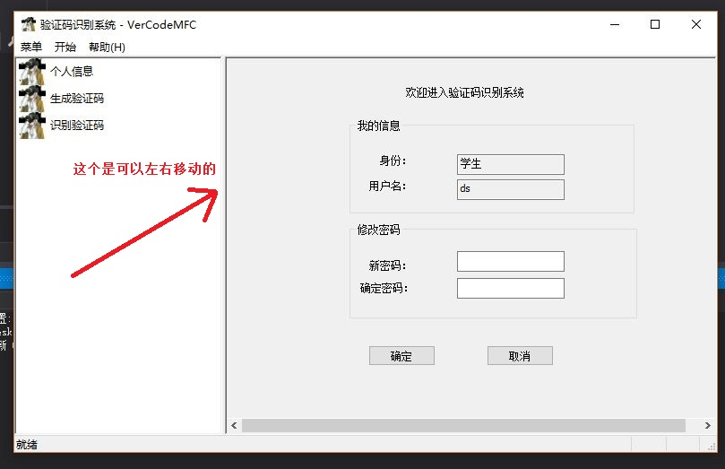
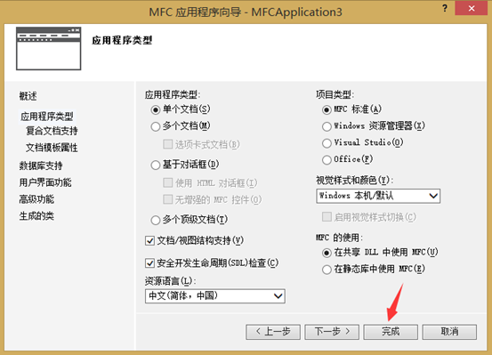
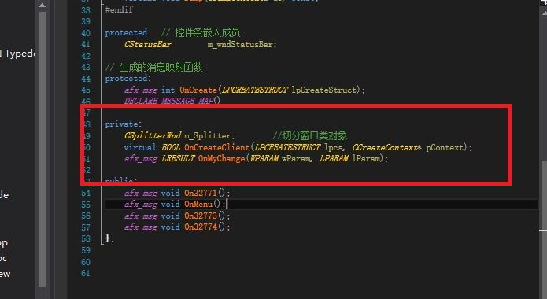
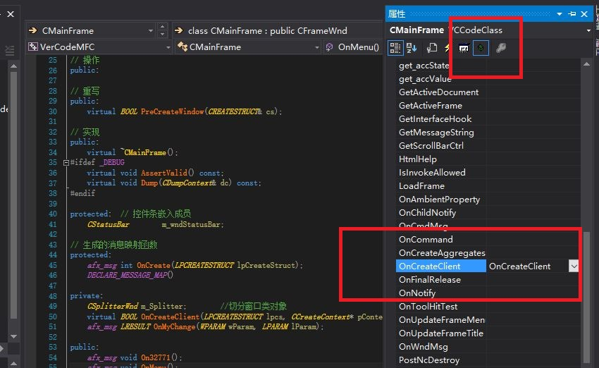
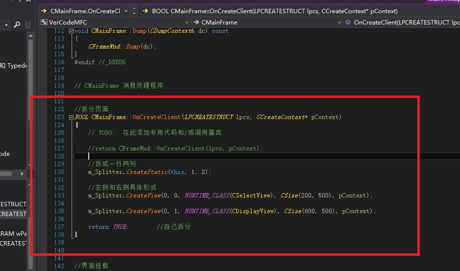
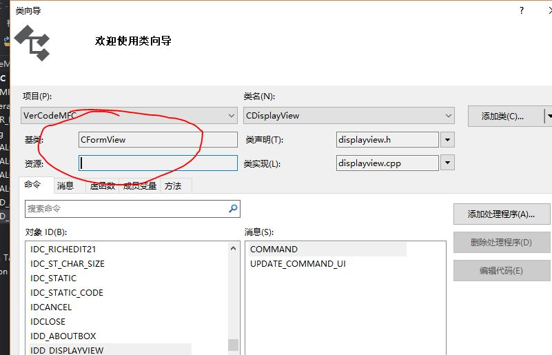

# MFC界面分屏操作

## 一、简介

开发MFC程序，会看到下图所示的分屏界面，中间的线可以左右移动。

对于这样的MFC程序，我们需要创建项目时选择`单个文档` ，像这样：

* 在MFC 框架中，为我们提供了一个csplitterwnd 类——拆分窗口类，提供分离窗口的功能。
* 那么，在框架类 CMainFrame中，我们要添加一个csplitterwnd 类型的成员变量，以供我们使用，像下图操作中在`MainFram.h` 中添加一个csplitterwnd 类型的成员变量。

## 二、具体操作

### 1.重写框架类 CMainFrame 中的OnCreateClient 事件

* 在事件中，我们要进行界面切分操作，并添加如下代码，

### 2.添加MFC类，选择`CFormView` 类

* 创建完视图之后，**要将它原先 return 的界面视图注销掉，返回我们切分后的视图界面**，我们也看到在 RUNTIME\_CLASS 宏函数中我们的值是空的，这里就是要我们添加我们自己的MFC类，添加类的时候选择添加MFC类，选择基类为`CFormView` 类；
* **奇怪的是vs2017就是这个东西不见了，我看着下拉框好几遍，没有！！！** 没办法，只能装老版本vs2013，奇怪的是卸载vs2017的时候，把我文件夹下所有的项目全清空了！！！
* 装回vs2013，瞬间找到了，上图：

* 创建好之后，返回到我们的框架类 CMainFrame中，并找到我们刚刚重写的OnCreateClient函数，将我们新建的视图类 添加至RUNTIME\_CLASS 宏函数的参数内，**记住头文件添加。**
* 最终效果见最开始那张图。
