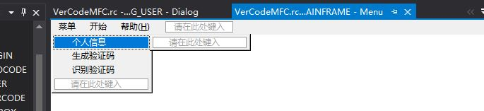

# 页面挂载

所有操作注意头文件的引用添加以及相关宏定义。

## 一、搭建页面

像这样，一个个加上去就行了，然后就是和之间一样添加MFC类，同样CDISPALYVIEW基类选CFormView，CLoginDlg 由于是默认界面选CDialogEx，其余的全选CFormView，树形图之后再说。


## 二、具体实现

### 1.在MainFrm.cpp的OnMyChange函数添加代码

```cpp
    if (wParam == WU_A)
    {
        //MessageBox(TEXT("个人信息挂载"));
        context.m_pNewViewClass = RUNTIME_CLASS(CUserDlg);
        context.m_pCurrentFrame = this;
        context.m_pLastView = (CFormView *)m_Splitter.GetPane(0, 1);
        m_Splitter.DeleteView(0, 1);
        m_Splitter.CreateView(0, 1, RUNTIME_CLASS(CUserDlg), CSize(600, 500), &context);
        CUserDlg *pNewView = (CUserDlg *)m_Splitter.GetPane(0, 1);
        m_Splitter.RecalcLayout();
        pNewView->OnInitialUpdate();
        m_Splitter.SetActivePane(0, 1);
    }
```

* 同时在上面进行宏定义，以及在.h文件中进行相关函数声明以及自定义消息


* 自定义消息：


### 2.菜单栏的页面切换

* 点击菜单栏，添加事件处理程序，它会自动生成函数处理程序名，选择默认就可以了。


* 在CMainFram中添加事件处理程序代码，其实就是页面的切换


* 现在基本上可以使用菜单栏切换页面了。



至此，基本上完成页面搭建。
