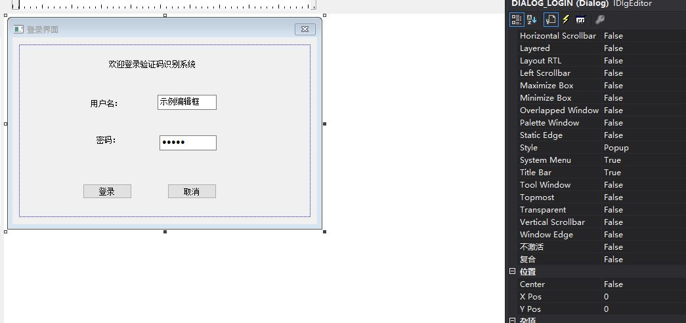
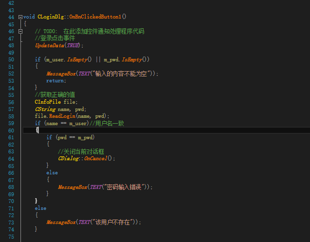

# 登录页面搭建

* 不一一上图了，都一样。

## 一、UI界面设计

* 如图，首先删除默认框的内容，修改框的属性，选中框添加类，由于是初始化界面，所以基类要选CDialogEx，然后就是添加两个文本框的变量，选择CString类型。

* 点击两个按钮开始写相关的事件代码

* 注意头文件和相关宏定义

## 二、说明

* 该功能的实现需要用到CinfoFile类，这个类集成了读取登录信息函数、修改密码函数还有销售管理系统要用到的相关函数，这里我们只需要调用我们需要用到的登录相关函数就行。
* 到此，登录页面搭建完成，完整的个人信息修改功能实现的代码已上传github，详见[SetPage.](https://github.com/ds19991999/VerCodeMFC/tree/master/SetPage)
