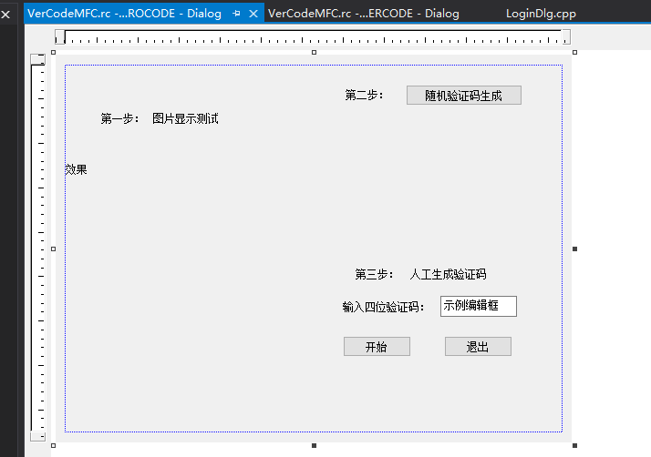
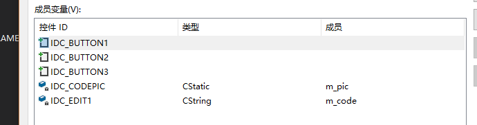
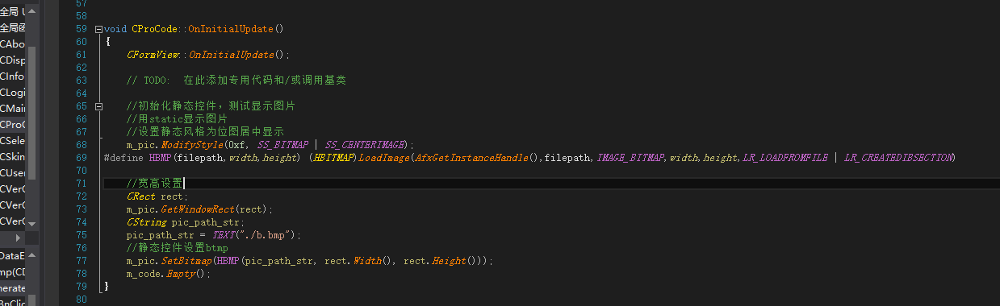
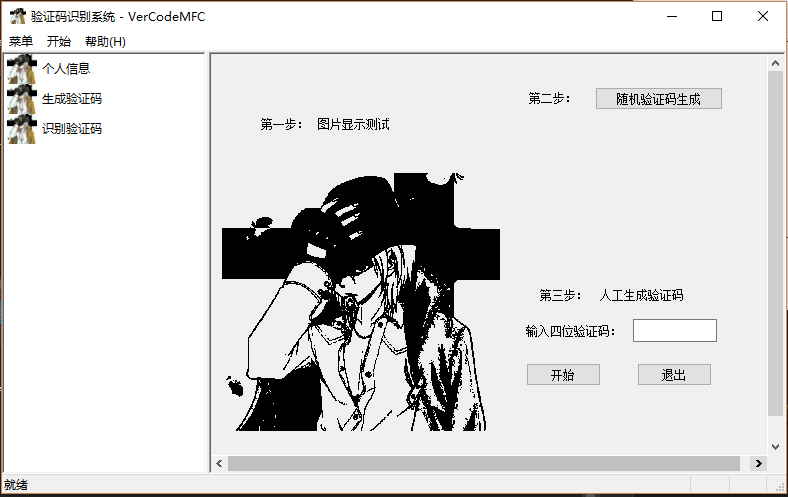
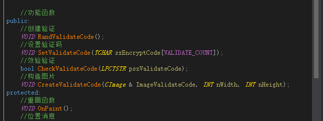
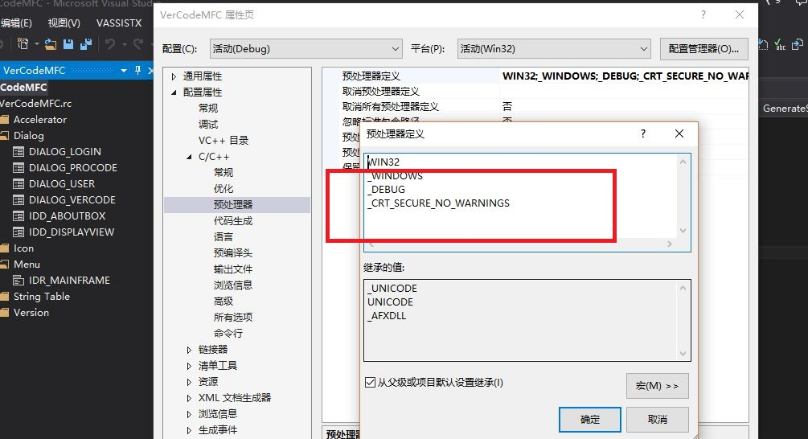

# 随机验证码的生成

## 一、UI设计

* 直接上图



* 使用静态文本框显示bmp图片进行测试，修改控件属性，定义框的类，同样基类为CFormView，相关成员变量如下：



## 二、关于显示图片

### 1.使用TextControl显示bmp格式的图片

* 由于我是想切换页面直接显示图片，也就是初始化直接显示图片，所以在该类中的初始化控件函数OnInitialUpdate进行初始化；



* 这几行代码基本上是通用的。
* 效果如图：



### 2.相关类的引用

* 这里用到CSkinValidateCode类，该类集成了创建验证码、设置验证码、校验验证码、构造函数等实用的函数接口，可以直接调用



* 自定义TEXT变量显示验证码，回到资源视图的验证码显示UI界面，点击确定按钮，定义触发确定按钮的点击事件，通过转向定义和MFC帮助文档查找Creat函数的参数相关信息，可以得知它是CStatic的成员函数，并且这个CStatic是CWnd的子类，之后就可以正确填写相关参数了；

```cpp
    CSkinValidateCode    m_WndValidateCode;
    //验证控件
    m_WndValidateCode.Create(m_code, WS_CHILD | WS_VISIBLE | SS_CENTER | SS_NOTIFY, CRect(330, 80, 480, 130), this, IDC_CODEPIC);//宽350-500   高80-130
    //创建验证码
    m_WndValidateCode.RandValidateCode();
    m_WndValidateCode.SetValidateCode(m_code.GetBuffer());
    //效验验证
    CImage img;
    if(!(m_WndValidateCode.CheckValidateCode(m_code)))
    {
        MessageBox(TEXT("人工验证码产生失败"));
        return;
    }
```

* 注意这里的变量类型不匹配，使用CString----&gt;TCHAR\*的装换方法GetBuffer。

```
    //类型转换：CString->TCHAR*
    //LPTSTR p = m_code.GetBuffer();
```

* 接下来就可以直接显示验证码了

### 3.随机CString字符串的产生

* 由于我们可以通过CString自定义变量显示验证码，所以接下来我们只需要写一个可以产生随机CString字符串的方法，直接在产生随机验证码CProCode上加；
* 具体代码如下：

```cpp
#define STR_LEN 4//定义随机输出的字符串长度。  
CString CProCode::GenerateStr()
{
    char str[STR_LEN + 1] = { 0 };
    int i, flag;

    srand((unsigned int)time(NULL));//通过时间函数设置随机数种子，使得每次运行结果随机。  
    for (i = 0; i < STR_LEN; i++)
    {
        flag = rand() % 3;
        switch (flag)
        {
        case 0:
            str[i] = rand() % 26 + 'a';
            break;
        case 1:
            str[i] = rand() % 26 + 'A';
            break;
        case 2:
            str[i] = rand() % 10 + '0';
            break;
        }
    }
    CString m_ranNum = CString(str);    //强制将char转换成CString
    return m_ranNum;
}
```

* 注意，这个函数我是用C写的，所以要添加相应的头文件time.h和宏定义，宏定义直接在C++预处理器定义中添加，具体位置直接上图：



* 至此，随机验证码产生基本实现，接下来就是优化取消按钮的功能以及CString文本框内容获取，与之前一样，不在累赘。

## 三、说明

* 项目至此已经实现登录界面，个人信息界面以及随机验证码产生界面，引用了CSkinValidateCode类；
* 具体代码已经上传至github，[ProRandCode](https://github.com/ds19991999/VerCodeMFC/tree/master/ProRandCode).
