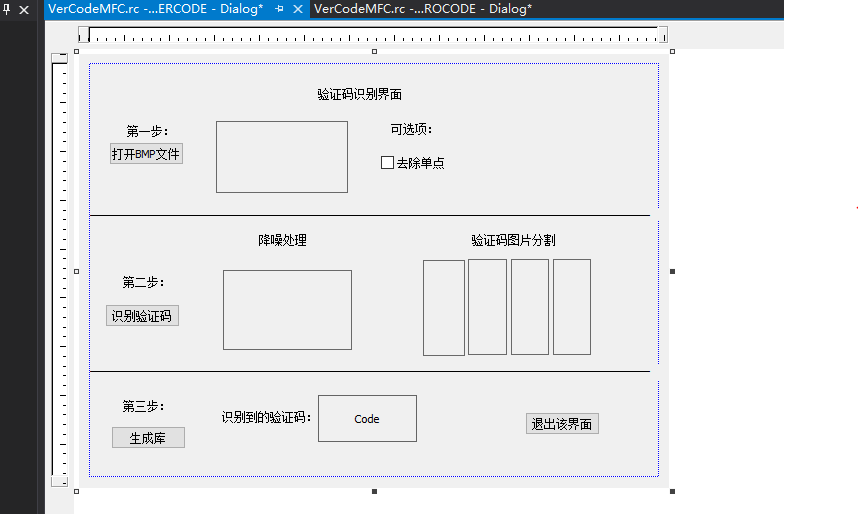

# BMP格式验证码的识别

## 一、UI设计

### 1.思路

* 由于要实现验证码的识别，必须要让用户自己选择图片，所以要有一个按钮来实现用户打开BMP格式的图片，确定之后获取图片的路径，通过字符串拼接的方法将路径传递给显示BMP图片的函数，之后在一个Picture Control控件中显示出来，相当于给Picture Control的控件赋值，之后根据Picture Control的自定义变量将BMP参数传递给验证码识别函数进行图片的分析和处理；
* 关于图片处理之后再说。

### 2.具体UI界面



### 3.添加类和变量

* 相关参数见图：


* 具体细节直接看源代码[VerCodeMFC.](https://github.com/ds19991999/VerCodeMFC/tree/master/VerCodeMFC_1.0)

## 二、具体功能实现

### 1.功能函数的实现

* 定义以下四个私有成员函数

```cpp
    void Denoise();                //去噪处理
    void ShowSplitedImg();            //显示分割的4张图片

    void GenerateBinPattern(CString strPath, CString strTitle);//生成模板以供匹配
    wchar_t GetCode(int **pChar);//取得最佳匹配的字符编码
```

* 这几个函数实现了BMP图片的二值化处理和去噪处理
* 关于去噪处理API：

```cpp
void CVerCode::Denoise()
{
    int i = 0;
    int j = 0;

    if (m_nDenoise & LEVEL_ISOLATE_PNT)
    {

        for (i = 0; i < m_nBmpWidth; i++)
        {
            for (j = 0; j < m_nBmpHeight; j++)
            {
                // 除去孤立的点
                if ((i == 0) || (m_pBuffer[i - 1][j] == 0))    // 上边点为0
                {
                    if ((i == (m_nBmpWidth - 1)) || (m_pBuffer[i + 1][j] == 0)) // 下边点为0
                    {
                        if ((j == 0) || (m_pBuffer[i][j - 1] == 0)) // 左边点为0
                        {
                            if ((j == (m_nBmpHeight - 1)) || (m_pBuffer[i][j + 1] == 0)) // 右边点为0
                            {
                                m_pBuffer[i][j] = 0;
                            }
                        }
                    }
                }
            }
        }
        //////////////////////////////////////////////////////////////////////////
        // 除去干扰的线条
        // 除去纵线
        int count = 0;
        int iStart = 0, iEnd = 0;
        for (i = 0; i < m_nBmpWidth; i++)
        {
            count = 0;
            for (j = 0; j < m_nBmpHeight; j++)
            {
                if (m_pBuffer[i][j] != 0)
                {
                    count++;
                }
                //else
                //{
                //    if (count >= (m_nBmpWidth/2))    // 连续的横点
                //    {
                //        iEnd = j;
                //        break;
                //    }
                //    else
                //    {
                //        count = 0;
                //        iStart = j;
                //    }
                //}
            }
            if (count >= (m_nBmpHeight - 5))
            {
                // 孤点的干扰纵线点予以删除
                for (int k = 0; k < m_nBmpHeight; k++)
                {
                    if ((i > 0) && (m_pBuffer[i - 1][k] != 0))
                    {

                    }
                    else if ((i != (m_nBmpWidth - 1)) && (m_pBuffer[i + 1][k] != 0))
                    {

                    }
                    else
                    {
                        m_pBuffer[i][k] = 0;
                    }

                }
            }
        }
        // 横线,跨越两个字符长度即为干扰线条
        for (j = 0; j < m_nBmpHeight; j++)
        {
            count = 0;
            for (i = 0; i < m_nBmpWidth; i++)
            {
                if (m_pBuffer[i][j] != 0)
                {
                    count++;
                }
                //else
                //{
                //    if (count >= (m_nBmpHeight-5))        // 连续的纵点
                //    {
                //        iEnd = i;
                //        break;
                //    }
                //    else
                //    {
                //        count = 0;
                //        iStart = i;
                //    }
                //}
            }
            if (count >= (m_nBmpWidth / 2))
            {
                // 孤立的干扰横线点予以删除
                for (int k = 0; k < m_nBmpWidth; k++)
                {
                    if ((j > 0) && (m_pBuffer[k][j - 1] != 0))    // 为孤立的点
                    {

                    }
                    else if ((j != (m_nBmpHeight - 1)) && (m_pBuffer[k][j + 1] != 0))
                    {

                    }
                    else
                    {
                        m_pBuffer[k][j] = 0;
                    }
                }
            }
        }

        //////////////////////////////////////////////////////////////////////////
        // 首尾两端像素置0
        for (i = 0; i < 5; i++)
        {
            for (j = 0; j < m_nBmpWidth; j++)
            {
                m_pBuffer[j][i] = 0;
            }
        }
        for (i = m_nBmpHeight - 2; i < m_nBmpHeight; i++)
        {
            for (j = 0; j < m_nBmpWidth; j++)
            {
                m_pBuffer[j][i] = 0;
            }
        }
    }


}
```

### 2.函数调用

* 回到资源视图的验证码识别UI界面，查看变量


* 定义好所有变量之后开始实现各个按钮以及其他控件的功能；

* bmp按钮事件功能实现


### 3.关于机器码识别按钮

* 这里需要用到二值化处理：

```cpp
    for (int x = 0; x < width; x++)
    {
        for (int y = 0; y < height; y++)
        {
            pixel = image.GetPixel(x, y);
            r = GetRValue(pixel);
            avg = (r < 220) ? 255 : 0;

            r = pixel & 0xFF;
            g = (pixel >> 8) & 0xFF;
            b = (pixel >> 16) & 0xFF;

            avg = ((r + g + b) > 500) ? 0 : 255;        // 黑色/白色两种
            //image.SetPixelRGB(x,y,avg,avg,avg);

            m_pBuffer[x][y] = avg;
        }
    }
```

* 二值化之后就可以显示图片了，这里调用去噪函数

```
    Denoise();    // 去躁

    ShowSplitedImg();    // 显示图片4部分
```

* 之后对已经处理的图片进行生成库处理，作为模板供下次识别匹配。

```cpp
void GenerateBinPattern(CString strPath, CString strTitle)
{
	CImage image;
	image.Load(strPath);
	vector<unsigned char> tmpVec;

	if (image.IsNull())
	{
		return;
	}
	int width = image.GetWidth();
	int height = image.GetHeight();

	CString strPatternPath = TEXT("patterns\\");
	strPatternPath += strTitle;
	strPatternPath += TEXT(".pat");

	FILE *pFile;
	_wfopen_s(&pFile, strPatternPath, TEXT("wb"));

	COLORREF pixel;
	int total = 0;
	unsigned char pix = 0x00;
	for (int i = 0; i < width; i++)
	{
		for (int j = 0; j < height; j++)
		{
			pixel = image.GetPixel(i, j);

			total = pixel & 0xFF;
			total += (pixel >> 8) & 0xFF;
			total += (pixel >> 16) & 0xFF;

			pix = (total < 100) ? 0xFF : 0x00;

			tmpVec.push_back(pix);

			fwrite(&pix, 1, 1, pFile);
		}
	}

	fclose(pFile);

	m_mapPatterns.insert(pair<wchar_t, vector<unsigned char> >(strTitle.GetAt(0), tmpVec));

	image.Destroy();
}
```

* 完成最难的部分之后，其他的一些简单的操作不再累赘.

## 三、说明

* 关于bmp验证码图片识别部分参考了网上一些代码提供的API，具体见[AutoVerCOdeben](https://github.com/ds19991999/VerCodeMFC/tree/master/AutoVercode)
* 至此，本项目基本功能完成，之后优化UI界面和修改一些可能会出现的bug，项目完成，该项目完整源代码见[VerCodeMFC 1.0 ](https://github.com/ds19991999/VerCodeMFC/tree/master/VerCodeMFC_1.0).
