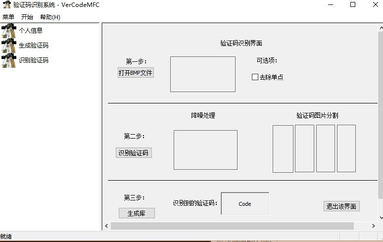
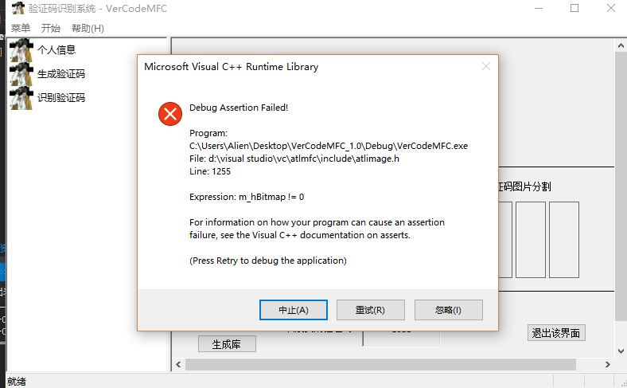

# 后序改进

## 一、存在一些未解决的bug

* 在下图界面先点击第二步的识别验证码，程序会崩！！！



* 像这样



* 这个问题就很严重了，有待解决。

## 二、完善

可以从以下几个方面进行完善：

* 增加用户信息库，而不是允许特定用户才能登录，可以使用数据库相关操作；
* 增加用户查询界面，查看有权限登录该系统的用户及其相关信息；
* 可以保存随机验证码图片到本地，直接供验证码识别界面使用学习，实现监督学习；
* bmp图片处理方面，改进那就太多了，像算法识别准确率的提高，图像处理相关的平滑、空间滤波、混合空间增强法、去噪、频率域滤波等等操作，这一块有太多的学问需要探讨，不再细究。

## 三、收获和感想

虽有一种说法：

> ```
> 苟有恒,何必三更眠五更起;最无益,莫过一日暴十日寒
> ```

但是，我们还是需要那种快速学习的能力，总有时候会遇到时间不允许的情况，在那种特殊时间段如何快速解决问题，这种能力很重要。

经过长达三天的闭关做课设，做这个课设之前我对MFC一无所知，根本不知道那是啥玩意，经过一天半的学习，大概搞懂了基本概念，半天熟悉VS的MFC开发环境，期间出现过vs2017的MFC类中找不到添加CFormView类，卸载重装vs2013结果把做了一半的课设项目全删了。

第三天，一切从新开始，不过也正是如此，对MFC的开发环境熟悉了一点，之后的操作也变得比第二天容易多了。

总之，基本完成了课设，学到了不少MFC知识，熟悉了开发的一般流程，获益匪浅。
